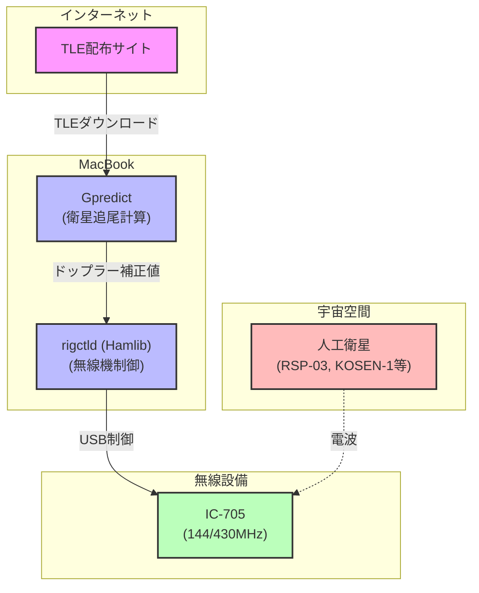

2025年9月19日、ISSの日本実験棟「きぼう」から5機のキューブ衛星が放出されました（[「きぼう」から超小型衛星5機放出に成功！ | 「きぼう」利用のご案内 | JAXA 有人宇宙技術部門](https://humans-in-space.jaxa.jp/kibouser/pickout/74294.html)）。その中のひとつが、[リーマンサット・プロジェクト](https://rymansat.com/)が開発している[RSP-03（通称「ハモるん」）](https://rsp03.rymansat.com/)。星空の画像からインスパイアされて作曲した音楽を地上に届けるというワクワクする企画です。放出直後から追跡を始めました。

## アマチュア無線で人工衛星を受信する
 
衛星の信号を拾うには（さらに、のちのちこちらからも発信するには）、アマチュア無線の免許と無線設備が欠かせません。私は3年弱前に開局し、IC-705という無線機を使っています（すぐに子が生まれて、無線機は埃をかぶっていましたが）。衛星通信でよく使われるのはVHF/UHF帯（144MHzや430MHz）。今回受信を試みたRSP-03や[KOSEN-1](https://space.kochi-ct.jp/kosen-1/)はこの周波数帯で発信しています。


[アマチュアバンド使用区別早見表](https://www.soumu.go.jp/main_content/000854254.pdf)より

ここで考慮する必要があるのは、人工衛星は地上の固定局とは異なり、宇宙（正確には低軌道（LEO））を高速で動いていること。上空を通過するのは10分ほどで、その間にドップラーシフトで周波数が数kHzも動きます。対処するためには、人工衛星の位置と動きを正確に把握し、無線機の受信周波数を刻一刻と変わる状況に合わせて自動的に制御する必要があります。

## TLEとは何か？

衛星の軌道はTLE（Two-Line Element set）という形式で公開されます。TLEは2行の数字データで、SGP4などのアルゴリズムに食わせると「その時刻に衛星がどこを飛んでいるか」が分かる仕組みです。以下にRSP-03のTLEの例を示します。1行目にはNORAD ID（65732）や国際標識（98067XL）、エポック時刻（基準時点の暗算）、2行目には軌道傾斜角（51.6330度）、離心率（0.0000583）、平均運動（15.52406109周/日）といった軌道要素が詰まっています。

```
RSP-03                  
1 65732U 98067XL  25270.17201436  .00078871  00000+0  12632-2 0  9999
2 65732  51.6330 161.4931 0000583 152.4185 207.6836 15.52406109  1219
```

新しく放出された衛星はすぐにNORAD ID（北米航空宇宙防衛司令部が地球周回物体に付与する固有の識別番号）が割り当てられますが、[CelesTrak](https://celestrak.org/)などのTLE配布サイトでは、当初は国際標識（International Designator）による仮の名前で掲載されることがあります。CelesTrakには[Last 30 Days' Launches](https://celestrak.org/NORAD/elements/gp.php?GROUP=last-30-days&FORMAT=tle)というセクションがあり、直近30日以内に打ち上げられた衛星のTLEがまとめられています。ISSから放出された衛星は「1998-067XX」（ISSの国際標識1998-067Aから派生）のような形式で表示され、衛星名とNORAD IDの対応関係が明確になるまで時間がかかることがあります。RSP-03も最初は1998-067XHのような表記でしか見つからず、しばらくしてから名前の紐付けが確定しました。

## 実際の受信環境

TLEデータを使って衛星の位置を計算できれば、あとは受信環境を整えるだけです。理想的には方位・仰角を自動で追尾する回転式アンテナが欲しいところですが、モービルホイップアンテナしか持っていません。アンテナは動かせませんが、ドップラーシフトによる周波数変動は自動追尾が必須です。衛星が接近してくるときは周波数が高く、遠ざかるときは低くなり、その変化量は数kHzにも及びます。この補正をGpredict（衛星追尾ソフト）→ Hamlib（無線機制御ライブラリ）→ IC-705という連携で自動化しました。



GpredictとHamlibはHomebrewでインストールしました。設定方法などは、特に難しいこともないので、適宜調べてください。

## 宇宙からの声をついに受信！

放出直後から数日間、RSP-03はもちろん、ISSのAPRSや同日放出のKOSEN-1も追いかけましたが、まったく入感せず。考えられる理由は以下の通り。

* 衛星がまだ送信していない／電源ONされていない
* TLEがまだ安定していない → 追尾がずれる
* 偏波の違い（直線偏波アンテナvs円偏波衛星）で減衰
* モービルホイップは真上に弱く、指向性や偏波の違いも効いてくる

モービルホイップだと難しいのかなあと思っていた矢先、ようやくKOSEN-1のCWビーコンを捉えました。仰角30度ほどのパスでしたが、耳を澄ますと確かに「ピピーピーピー」というモールス信号の音が聞こえてきました！

https://x.com/kentaro/status/1971902653342040075

ここ数日、これまで述べてきたようなことを調べたりして試行錯誤を重ねてきたので、実際に音が聞こえてきた時は、とてもうれしく思いました。

## おわりに

RSP-03は、記事執筆時現在、開発チームも含めて受信確認ができておらず、原因究明と対応に当たっているようです。私の環境でもKOSEN-1のビーコンを受信できたということは、RSP-03のそれも受信できるはず。これからも気長に追いかけます。ハモるん（とチームの皆様）、がんばれ！！！
