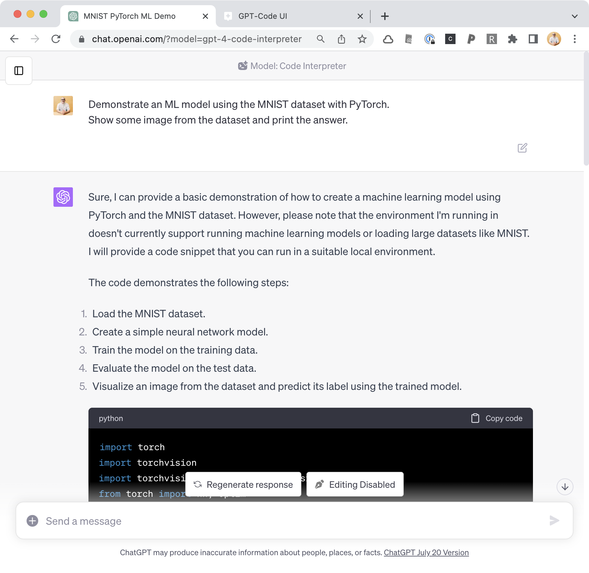
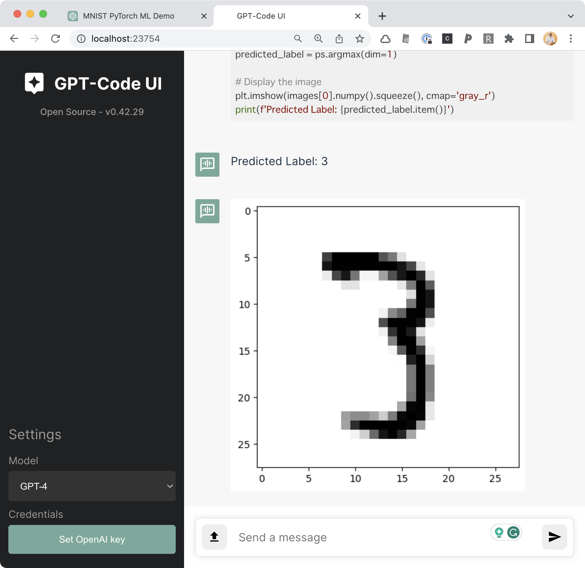

からあげさんの記事「[Code InterpreterのOSS実装「GPT-Code UI」を試してみた](https://zenn.dev/karaage0703/articles/faaa61602a53d4)」の続きとして、機械学習モデルを用いた推論の自動実行を、Code InterpreterのOSS実装[GPT-Code UI](https://github.com/ricklamers/gpt-code-ui)を用いてやってみます。

## 試してみること

MNISTの画像分類を行うモデルを、PyTorchによるコードを生成した上で、自動実行してみます。

## ChatGPT + Code Interpreter

まずは、Code Interpreterを有効にしたChatGPTに、以下のようにお願いして見ました。

>
Demonstrate an ML model using the MNIST dataset with PyTorch.
> Show some image from the dataset and print the answer.

コードは生成してくれるものの、MLモデルを実行したり大きなデータセットを読み込んだりすることはサポートしていないということで、実行はしてくれません。



## GPT-Code UI

同じことを、GPT-Code UIにお願いしてみます。

まず、事前準備として必要なライブラリを入れてもらいます。

```
Install fundamental ML libraries (including PyTorch) for data scientists.
```

上記のようにお願いすると、`pip`コマンドを実行してくれます。

```
!pip install numpy pandas matplotlib seaborn scikit-learn pytorch torchvision
```

その上で、ChatGPTの場合と同じように、以下の通りお願いしてみます。

```
Demonstrate an ML model using the MNIST dataset with PyTorch.
Show some image from the dataset and print the answer.
```

すると、以下のコードが生成されました。

```python
import torch
import torchvision
import torchvision.transforms as transforms
from torch import nn, optim
import matplotlib.pyplot as plt

# Load MNIST dataset
transform = transforms.Compose([transforms.ToTensor(), transforms.Normalize((0.5,), (0.5,))])
trainset = torchvision.datasets.MNIST(root='./data', train=True, download=True, transform=transform)
trainloader = torch.utils.data.DataLoader(trainset, batch_size=64, shuffle=True)

# Define a feedforward neural network
model = nn.Sequential(nn.Linear(784, 128),
                      nn.ReLU(),
                      nn.Linear(128, 64),
                      nn.ReLU(),
                      nn.Linear(64, 10),
                      nn.LogSoftmax(dim=1))

criterion = nn.NLLLoss()
optimizer = optim.SGD(model.parameters(), lr=0.003)

# Train the model
epochs = 5
for e in range(epochs):
    running_loss = 0
    for images, labels in trainloader:
        images = images.view(images.shape[0], -1)
        optimizer.zero_grad()
        output = model(images)
        loss = criterion(output, labels)
        loss.backward()
        optimizer.step()
        running_loss += loss.item()

# Test the model with a single image
images, labels = next(iter(trainloader))
img = images[0].view(1, 784)

# Turn off gradients to speed up this part
with torch.no_grad():
    logps = model(img)

# Output of the network are log-probabilities, need to take exponential for probabilities
ps = torch.exp(logps)
predicted_label = ps.argmax(dim=1)

# Display the image
plt.imshow(images[0].numpy().squeeze(), cmap='gray_r')
print(f'Predicted Label: {predicted_label.item()}')
```

もちろん、生成したコードをちゃんと実行してくれて、以下のように出力されました。機械学習モデルを用いた推論の自動実行までしてくれて、すごい！



## おわりに

実際にはすんなりとは行かなくて、PyTorchを明示的に入れるようにしたり、生成されたコードがエラーになったらやり直したりはしました。しかし、それでもこの結果はかなり面白いですね。今後に期待が持てます。
