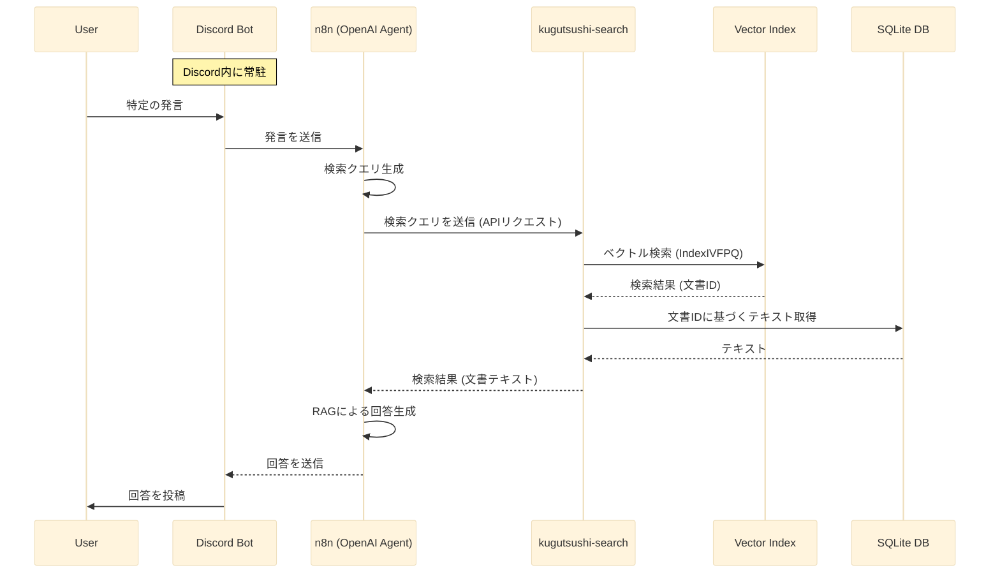

## 1．はじめに

ここ数日作っていたローカルPDF検索エンジン「kugutsushi-search」について書きます。これは、PDFドキュメントを検索するためのベクトル検索エンジンで、特にRaspberry Pi 4Bのようなスペックが控えめな環境でも、100GB超の書籍PDF群を全文検索できるようにしました。さらに、同じくRaspberry Pi上で動くDiscordボットとn8nと組み合わせて、RAG（Retrieval-Augmented Generation）システムのバックエンドとしても使えるようにしています。

この数年、大規模言語モデル（LLM）の進化に伴って、RAG技術が注目されていますよね。RAGは、LLMの知識を外部知識で補強して、より正確な回答を生成する手法です。このプロジェクトでは、RAGシステムの外部知識として、手元にある書籍PDF群を活用できないかと考えました。特に、大量のデータでも、Raspberry Piで効率よく検索できるようにすることを目指しました。

以下のリポジトリで公開しています。

https://github.com/kentaro/kugutsushi-search

**システムの動作イメージ**

書籍PDFからページ単位でテキストを抽出したことで、出典として書籍名とページ番号を表示できるようにしました。


「kugutsushi-search」は、PDFからテキストを抽出して、文をベクトル化してインデックスを作ることで、100GB超の書籍PDFのような大量のデータでも、Raspberry Piで高速に似たような文書を探せるようにしたシステムです。主な特徴はこんな感じです。

*   高速なPDFテキスト抽出: [PyMuPDF](https://pymupdf.readthedocs.io/en/latest/)ライブラリを使って、PDFから素早くテキストを抽出します。マルチスレッドで処理するので、大量のPDFもサクサク処理できます。
*   日本語に特化した文のベクトル化: [hotchpotch/static-embedding-japanese](https://huggingface.co/hotchpotch/static-embedding-japanese)モデルを使って、日本語テキストを効率よくベクトル化します。ベクトルの次元を128次元まで減らすことで、インデックスのサイズと計算量を大幅に削減しています。
*   高速な検索: [faiss](https://github.com/facebookresearch/faiss)ライブラリを使って、IndexIVFPQという仕組みで、限られたリソースでも高次元ベクトルの類似検索をサクサク実行できます。
*   プラットフォームを選ばない: ベクトルデータをnumpy形式で保存して、Raspberry Pi上で起動するときにfaissインデックスを作り直すことで、異なるプラットフォーム間でも問題なく動作します。
*   Dockerで簡単環境構築: [マルチステージビルド](https://docs.docker.com/build/building/multi-stage/)を使ったDockerコンテナにして、イメージサイズを5GBから1GBまで減らしました。
*   CLIとAPI両方対応: コマンドラインツールと[FastAPI](https://fastapi.tiangolo.com/ja/)の両方を用意したので、いろんな使い方ができます。特にAPIは、[n8n](https://n8n.io/)と連携することを想定しています。

### 2.1．システムの構成

このシステムは、以下の3つの部品で構成されています。

1.  **Discordボット**:  Raspberry Pi 4B上で動いていて、特定の発言を見つけます。
2.  **n8n**:  ワークフロー自動化ツールn8n上で動くOpenAIエージェントです。Discordボットからリクエストを受け取って、検索クエリを作って、RAGで回答を生成します。
3.  **kugutsushi-search**:  このプロジェクトのPDF検索エンジンです。n8nから検索クエリを受け取って、関連する文書を探して返します。**100GB超の書籍PDF**をインデックス化して、**Raspberry Pi 4B**上で効率よく検索できます。

ここでn8nを使っているのは、他にもワークフローの自動化などでn8nを中心的にAI関連の仕組みを作っているからです。

### 2.2．検索の流れ

こんな感じで動きます。

1.  Discordボットが特定の発言を見つけます
2.  ボットがn8nにリクエストを投げます
3.  n8n上のOpenAIエージェントが、その発言から検索用のクエリを作ります
4.  エージェントが「kugutsushi-search」のAPIにクエリを投げます
5.  「kugutsushi-search」が**IndexIVFPQインデックス**を使って検索して、関連する文書をn8nに返します。**大量のデータ**でも高速に検索できます
6.  n8n上のエージェントが、検索結果と元の発言を使ってRAGで回答を作ります
7.  n8nがその回答をDiscordボットに返します
8.  ボットが回答をDiscordチャンネルに投稿します

### 2.3．検索の流れの図



## 3．技術的な話

### 3.1．プラットフォームを選ばない仕組み

faissを用いる上で、インデックスを異なるプラットフォーム間で共有できないという問題がありました。そこで、このプロジェクトでは、ベクトルデータをnumpy形式（.npy）で保存しておいて、アプリ起動時にそのデータをメモリに読み込んでfaissのIndexIVFPQインデックスを構築するようにしました。これで、開発環境（Mac）で作ったベクトルデータを本番環境（Raspberry Pi）でも簡単に使えるようになりました。

**実際の運用フロー：**

1. 開発環境（Mac）でインデックスを作成
   - PDFからのテキスト抽出
   - ベクトル化と次元削減
   - numpy形式でベクトルデータを保存

2. 本番環境（Raspberry Pi）にデプロイ
   - numpy形式のベクトルデータをコピー
   - アプリ起動時にベクトルデータを読み込んでインデックスを構築
   - 検索機能のみを提供

この方式により、計算リソースが必要なインデックス作成は高性能なMac上で行い、Raspberry Piではメモリ効率の良い検索処理のみを実行するという最適な役割分担が実現できています。

### 3.2．PDFからテキストを取り出す

PDFからテキストを取り出すのにはPyMuPDFというライブラリを使いました。このライブラリは日本語PDFも含めて、高速で正確にテキストを抽出できます。マルチスレッドで処理するようにしたので、大量のPDFもサクサク処理できます。

### 3.3．文章をベクトル化する

文章をベクトル化するのに、hotchpotch/static-embedding-japaneseというモデルを使いました。これはSentence-BERTをベースにした日本語特化モデルで、日本語の文章を高精度にベクトル化できます。検索クエリとPDFの文章の類似度を正確に計算するには、こういった適切なモデルを選ぶのが大事なんです。

大量のデータを扱えるようにするため、ベクトルの次元を1024から128に減らしました。これで、インデックスのサイズがぐっと小さくなって、メモリの使用量も抑えられます。特にRaspberry Piでは、この工夫が必須でした。

### 3.4．検索の仕組み

検索エンジンの部分にはfaissというライブラリを使いました。faissは大量のベクトルデータを高速に検索できるライブラリで、このプロジェクトみたいなローカル環境での使用にぴったりです。

最初はIndexFlatL2インデックスを使っていたんですが、大量のデータを扱うためにIndexIVFPQインデックスに切り替えました。これはInverted File System (IVF)とProduct Quantization (PQ)を組み合わせた仕組みで、IndexFlatL2と比べて、インデックスのサイズと検索時間を大幅に減らせます。この切り替えで、100GB超の書籍PDFのベクトルインデックスを約170MB（IndexFlatL2だと約2GB）まで小さくできました。これのおかげで、Raspberry Piでも大量のデータを検索できるようになりました。

### 3.5．Docker環境

このプロジェクトはDockerコンテナとして配布しています。Dockerfileを用意したので、誰でも簡単に環境を作れます。特にRaspberry Piでも使えるように、arm64アーキテクチャ対応のDockerイメージも用意しました。

Dockerイメージを小さくするために、マルチステージビルドという方法を使いました。これは、ビルドに必要なツールや中間ファイルを最終的なイメージに含めない方法で、イメージのサイズをぐっと小さくできます。この方法で、Dockerイメージを5GBから1GBまで小さくすることができました。これで、本番環境でも簡単にデプロイできるようになりましたし、イメージのダウンロードも起動も速くなりました。

## 4．実装の話

### 4.1．ディレクトリ構成

プロジェクトのファイルはこんな感じに配置しています。

```
kugutsushi-search/
├── embeddings/           # ベクトルデータの保存場所
├── src/                  # ソースコード
│   ├── extractor.py      # PDFからテキストを取り出す部分
│   ├── embedder.py       # 文章をベクトル化する部分
│   ├── indexer.py        # インデックスを作る部分
│   ├── api.py            # APIエンドポイント（FastAPI）
│   ├── cli.py            # コマンドラインツール
│   └── main.py           # APIサーバーの起動
├── tests/                # テストコード
├── requirements.txt      # 必要なパッケージ一覧
├── Dockerfile            # Docker設定
└── README.md             # プロジェクトの説明
```

### 4.2．主要な部品の説明

*   extractor.py: PyMuPDFを使ってPDFからテキストを取り出します。複数のスレッドで並列処理できるし、進捗状況も見れるようになっています。大量のデータもサクサク処理できます。
*   embedder.py: hotchpotch/static-embedding-japaneseを使って文章をベクトル化します。次元を128まで減らすことで、メモリ使用量と計算量を抑えています。
*   indexer.py: faissを使ってベクトルのインデックスを作ります。numpy形式でベクトルデータを保存して、起動時にインデックスを作り直す機能に加えて、IndexIVFPQを使ってインデックスを小さくして高速に検索できるようにしています。
*   api.py: FastAPIを使ってAPIエンドポイントを提供します。PDFのアップロードと検索ができます。大量のデータの検索にも対応しています。
*   cli.py: コマンドラインツールです。PDFのアップロードと検索をコマンドラインから実行できます。大量のデータの処理にも対応しています。
*   main.py: APIサーバーを起動するためのエントリーポイントです。Raspberry Piでの動作を想定しています。

### 4.3．APIの使い方

APIサーバーは以下のエンドポイントを提供しています。

*   `/upload` (POST): PDFファイルをアップロードすると、ベクトルインデックスを更新します。大量のデータのインデックス作成もOKです。
*   `/search` (GET): 検索クエリを受け取って、IndexIVFPQを使って高速に検索して、結果をJSONで返します。Raspberry Piでもサクサク検索できます。

### 4.4．コマンドラインツールの使い方

コマンドラインツールでは以下のコマンドが使えます。

*   `upload <file>`: PDFファイルをアップロードします。大量のデータのインデックス作成もOKです。
*   `search <query>`: 検索クエリを実行します。IndexIVFPQを使って高速に検索できます。

### 4.5．Docker環境の作り方

Docker環境の作り方と使い方は、README.mdに詳しく書いています。マルチステージビルドでイメージを小さくしたので、本番環境でも簡単に環境を作って動かすことができます。

## 5．これからやりたいこと

### 5.1．検索精度を上げる

今のシステムでは、ベクトルの次元を減らすことと、IndexIVFPQを使うことで、Raspberry Piでも大量のデータを検索できるようにしました。ただ、これらの最適化により、検索精度が少し落ちる可能性があります。

これからは、検索精度とリソースの効率のバランスを取るために、こんなことを試してみたいと思っています。

*   より良いベクトル化モデルの採用: 次元を減らしても精度が落ちにくい、より良いモデルや、ファインチューニングしたモデルを試してみます。
*   IndexIVFPQの設定調整: IndexIVFPQの設定（nlist, M, nbits_per_idxなど）を調整して、検索精度とインデックスのサイズ、検索速度のバランスを取ります。
*   Rerankingの導入: 最初の検索結果に対して、もっと賢いモデルでReranking（順位付け直し）をすることで、検索精度を上げます。

### 5.2．検索結果をハイライトする

検索結果で、クエリに一致する部分をハイライトする機能があると、ユーザーが結果を理解しやすくなります。これは今後の課題の一つとして考えています。特に大量のデータを検索する場合、ハイライト表示があると結果を絞り込みやすくなります。

### 5.3．もっと大きなデータセットに対応する

IndexIVFPQを使うことで、100GB超の書籍PDFをRaspberry Piで検索できるようになりましたが、さらに大きなデータセットや、もっと速い検索のために、まだまだ改善の余地があります。

これからは、こんなことを試してみたいと思っています。

*   ベクトルの圧縮方法の改善: Product Quantization以外の圧縮方法（Binary QuantizationやScalar Quantizationなど）も試して、インデックスのサイズをもっと小さくします。
*   分散検索システムの導入: もっと大きなデータセットに対応するため、分散検索システムの導入を検討します。faissには分散検索の機能もあるので、これを試してみます。

### 5.4．多言語対応

今のシステムは日本語に特化していますが、将来的には他の言語にも対応させたいと考えています。多言語対応のベクトル化モデルや、言語ごとの前処理を実装することで、より汎用的な検索エンジンにできます。大量の多言語データに対応するには、多言語対応の圧縮技術や分散検索システムも必要になってきます。

## 6．まとめ

このプロジェクトでは、100GB超の書籍PDFをRaspberry Piで全文検索できるようにするため、次元削減、IndexIVFPQ、マルチステージビルドといった工夫をしました。その開発の背景や技術的な話、実装方法、これからやりたいことについて紹介しました。

プラットフォームを選ばず、高速で、省リソースで、デプロイが簡単な検索エンジンを実現できました。これからも、検索精度を上げたり、機能を追加したり、もっと大きなデータセットに対応したり、多言語対応したりと、いろんな課題に取り組んで、「kugutsushi-search」をもっと使いやすい検索エンジンにしていきたいと思っています。

**謝辞**

このプロジェクトを作るにあたって、PyMuPDF、faiss、hotchpotch/static-embedding-japanese、FastAPI、n8nといった素晴らしいOSSの力を借りました。また、IndexIVFPQ、次元削減、Dockerマルチステージビルドといった最適化の技術は、多くの先駆的な開発者・研究者の皆さんの成果を参考にさせていただきました。この場を借りて、お礼を申し上げます。

## 7．参考文献

*   PyMuPDF: [https://pymupdf.readthedocs.io/en/latest/](https://pymupdf.readthedocs.io/en/latest/)
*   faiss: [https://github.com/facebookresearch/faiss](https://github.com/facebookresearch/faiss)
*   hotchpotch/static-embedding-japanese: [https://huggingface.co/hotchpotch/static-embedding-japanese](https://huggingface.co/hotchpotch/static-embedding-japanese)
*   FastAPI: [https://fastapi.tiangolo.com/](https://fastapi.tiangolo.com/ja/)
*   n8n: [https://n8n.io/](https://n8n.io/)
*   Docker multi-stage builds: [https://docs.docker.com/build/building/multi-stage/](https://docs.docker.com/build/building/multi-stage/)
