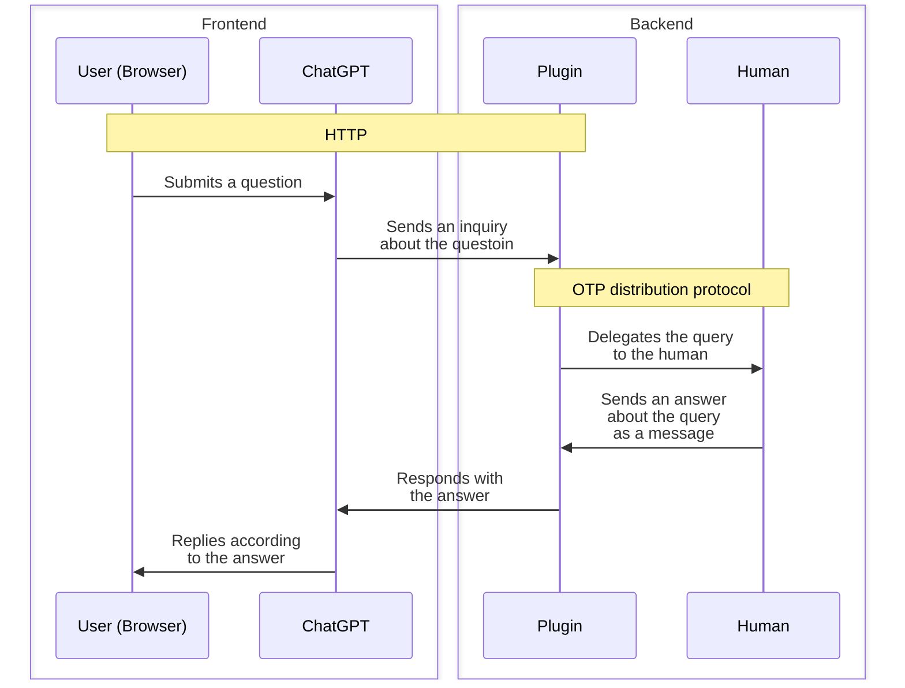

[ChatGPT plugins](https://openai.com/blog/chatgpt-plugins)、楽しいですね。しばらく前に僕も使えるようになったので、さっそく先日作った[ChatWP](https://zenn.dev/kentarok/articles/a99e51079a8071)を[ChatGPTプラグインに対応](https://github.com/kentaro/chatwp#chatgpt-plugin)したりして遊んでいます。

一方で、AIが賢くたって、人間にしかわからないこともあります。そんなわけで、ChatWPをプラグイン対応したものをよりももうちょっとだけ凝った例として、プラグインの後ろにいる人間に質問するような仕組みをごく簡単に作ってみました。

## オーバービュー

以下の図のような構成をとってみました。ChatGPTによるフロントエンドと、プラグインとその裏にあるOTP distribution（Erlang/OTPの提供する分散プロトコル）によるバックエンドで構成されています。



AIを上記のような形で組み込んだWebシステムのアーキテクチャを一般化して、Divergence-Convergence Patternと呼んでいます。

https://twitter.com/kentaro/status/1641652292079472642

https://twitter.com/kentaro/status/1641653293486321665

この記事も、その一例ということになりましょう。

## 使い方

1. まずプラグインとしてふるまうサーバを起動します。

```sh
iex --sname plugin@localhost -S mix
```

2. 上記のプラグインを、ChatGPTのUIからlocalhostプラグインとしてインストールします。
3. 人間が質問に答えるためのインターフェイスを起動します。

```sh
iex --sname human@localhost lib/human_tool/human.ex
```

4. ChatGPT上から適当に質問をすると、3.のコンソールに質問が届くので、HumanToolとして回答してあげて下さい。

以下の動画にまとめてあるので、そちらもご覧ください。

https://youtu.be/zt0zXF1cMPg


## おわりに

人間をChain of Thoughtに組み込むということ自体は、[LangChainが対応](https://python.langchain.com/en/latest/modules/agents/tools/examples/human_tools.html)していたりします。ここでのポイントとしては、

* フロントエンドとバックエンドを明確にするために、異なる通信プロトコル・要素技術でシステムを構成した
* OTP distributionプロトコルを用いて、将来的にもっと面白いことをしたいので、そのための予備実験を行った

といったところです。今後、ここで示した構成を応用して、あれこれやっていきたいつもりです。
