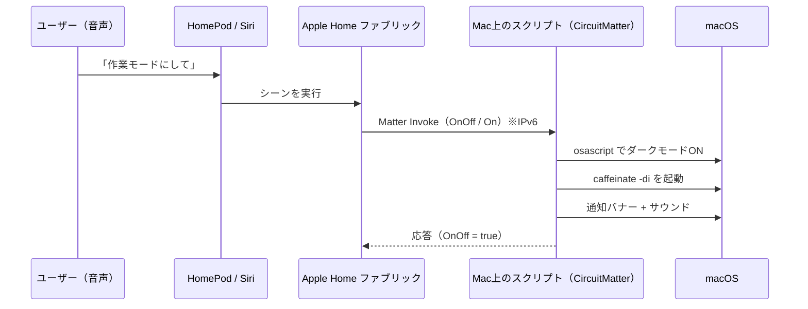

## きっかけ

「この部屋にMatterを喋るデバイスっている？」という素朴な疑問から始まりました。

Matter対応の家電が自宅にあるのか、カタログの一般論ではなく、Macから実際にネットワークを覗いて確かめてみたのです。
Matterの運用中デバイスは、mDNS（DNS-SD）で `_matter._tcp` というサービスを広告します。
`dns-sd` でブラウズすると、たしかに1台見つかりました。

```console
$ dns-sd -B _matter._tcp local.
Timestamp     A/R  Flags  if Domain   Service Type    Instance Name
17:41:29.620  Add      2  14 local.   _matter._tcp.   D3149ED749B71EA2-000000003DEEA4A6
```

インスタンス名の `D3149ED749B71EA2-000000003DEEA4A6` は、Matterの運用ノードの命名規則そのものです。
ハイフンの前が**圧縮ファブリックID**（そのデバイスが所属するファブリックの識別子）、後ろが**ノードID**を表します[^spec]。

[^spec]: Matterの運用ディスカバリの命名規則（`<compressed-fabric-id>-<node-id>._matter._tcp`）は Matter Core Specification で定義されています。実装は [project-chip/connectedhomeip](https://github.com/project-chip/connectedhomeip) を参照。確認日 2026-08-13。

ホスト名とIPv6アドレスをたどっていくと、正体が判明しました。
このノードのアドレスは、部屋にあるHomePodのアドレスと完全に一致していたのです。
つまり見つかった「Matterデバイス」は、家電ではなくHomePod自身でした。

HomePodは、ホームハブになった時点でApple HomeのMatterファブリックを自動生成し、たとえ制御対象のアクセサリが一つもなくても、自分をファブリックのノードとして `_matter._tcp` に広告します。
話し相手のいないHomePodが、Matterの受付窓口だけを開けて待っている状態でした。

窓口が空いているなら、こちらから客を送り込めばよいはずです。
そこで、このMac自身をMatterアクセサリに仕立てて、HomePodやSiriから操作できるようにしてみました。

## 作るもの

「作業モードスイッチ」を作ります。
HomePod、iPhone、iPad、Siriのいずれからオンにしても、電源には一切触れず、次の状態を切り替えます。

- **オン**：画面をダークアピアランスにして、Macを眠らせない（`caffeinate`）
- **オフ**：ライトアピアランスに戻して、スリープを許可する

「ヘイSiri、作業モードにして」で、書斎のMacが作業モードに入る、という体験です。

一般に、PCをHomeKitやMatterに露出させるにはHomebridgeやMatterbridgeといったブリッジを使います。
ただ今回やりたいことは、スイッチのオンとオフに応じてシェルコマンドを叩くだけです。
ブリッジを立てるまでもなく、100行ほどのスクリプトで足ります。

## 仕組み

音声から実際の動作までの流れは次のとおりです。



Matterデバイスの実体は、ネットワークで待ち受けてコマンドを処理し続けるプロセスです。
HomePodやオートメーションから操作できるようにする以上、この常駐プロセスは避けられません。
その常駐プロセスを、できるだけ小さく書きます。

## 実装

MatterデバイスをPythonだけで実装できる[CircuitMatter](https://github.com/adafruit/circuitmatter)（Adafruit製）を使います。
On/Offライト（デバイスタイプ `0x0100`）のサンプルが用意されているので、ハンドラの中身だけを差し替えます。

```python
import subprocess
import atexit
import circuitmatter as cm
from circuitmatter.device_types.lighting.on_off import OnOffLight


def notify(title, message, sound):
    subprocess.run(["osascript", "-e",
        f'display notification "{message}" with title "{title}"'])
    subprocess.run(["afplay", f"/System/Library/Sounds/{sound}.aiff"])


def set_dark_mode(enabled: bool):
    value = "true" if enabled else "false"
    subprocess.run(["osascript", "-e",
        f'tell application "System Events" to tell appearance preferences '
        f'to set dark mode to {value}'])


class Caffeine:
    """caffeinate プロセスを一つだけ抱える。ONで起動・OFFで停止。"""
    def __init__(self):
        self._proc = None
        atexit.register(self.stop)

    def start(self):
        if self._proc is None or self._proc.poll() is not None:
            self._proc = subprocess.Popen(["caffeinate", "-di"])

    def stop(self):
        if self._proc is not None and self._proc.poll() is None:
            self._proc.terminate()
        self._proc = None


caffeine = Caffeine()


class FocusModeSwitch(OnOffLight):
    def on(self):
        set_dark_mode(True)
        caffeine.start()
        notify("🟢 作業モード ON", "ダークに・Macを眠らせない設定にしました", "Glass")

    def off(self):
        set_dark_mode(False)
        caffeine.stop()
        notify("⚪️ 作業モード OFF", "ライトに戻し・スリープを許可しました", "Bottle")
```

あとはデバイスを起動するだけです。

```python
matter = cm.CircuitMatter(product_name="Mac Focus Switch")
matter.add_device(FocusModeSwitch("あんちぽのMac"))
while True:
    matter.process_packets()
```

ここまでが骨格です。
ただし、これをmacOSで実際に動かすまでに、三つの引っかかりがありました。
順に潰していきます。

### その1：Matterの通信にはIPv6が要る

Matterの運用通信はIPv6を前提にしています。
ところが、このMacのWi-FiはIPv6が「手動」設定のままで、アドレスが一つも振られていませんでした。
この状態ではアクセサリを立てても、コントローラが繋がってこられません。

自動取得に切り替えると解決します。

```console
$ networksetup -setv6automatic Wi-Fi
```

切り替えた直後、`en0` にリンクローカルとユニークローカルのIPv6アドレスが付き、HomePodのMatterポートまでpingが通るようになりました。

### その2：macOSにはavahiがない

CircuitMatterは、mDNSの広告にLinuxの `avahi-publish-service` を呼び出します。
macOSにavahiはありません。
代わりに、macOS標準のBonjour（`dns-sd -R`）で広告する薄いバックエンドを差し込みます。

```python
import subprocess


class Bonjour:
    """macOSネイティブ(dns-sd)で Matter サービスを広告する。"""
    def __init__(self):
        self.active_services = {}

    def advertise_service(self, service_type, protocol, port,
                          txt_records={}, subtypes=[], instance_name=""):
        # "_L3840._sub._matterc._udp" → dns-sd が欲しいのは先頭ラベル "_L3840"
        labels = [s.split("._sub", 1)[0] for s in subtypes]
        type_arg = f"{service_type}.{protocol}"
        if labels:
            type_arg += "," + ",".join(labels)
        txt = [f"{k}={v}" for k, v in txt_records.items()]
        cmd = ["dns-sd", "-R", instance_name or "CircuitMatter",
               type_arg, "local", str(port), *txt]
        self.active_services[service_type + instance_name] = subprocess.Popen(
            cmd, stdout=subprocess.DEVNULL, stderr=subprocess.DEVNULL)
```

`CircuitMatter(mdns_server=Bonjour())` のように渡せば、Bonjour経由で広告されます。

### その3：コミッショニング直後にライブラリがクラッシュする

コントローラ側でアクセサリを追加すると、CircuitMatter（0.4.1）が例外で落ちました。

```
AttributeError: 'dict' object has no attribute 'encode_into'
```

原因を追うと、アクセス制御リスト（ACL）属性のエンコードにバグがありました。
コントローラがACLを書き込むと、そのエントリは生の辞書（`dict`）としてデバイス側に保持されます。
ところがエンコード時には、辞書を構造体（`Structure`）と取り違えて `.encode_into` を呼んでしまい、辞書にそのメソッドがないため落ちます。
ここに到達しているということは、コミッショニング自体は最後まで進んでいて、クラッシュはその直後の購読処理で起きています。

エンコードの直前に、辞書を該当する構造体へ変換してやれば直ります。

```python
from circuitmatter import tlv as _tlv

_orig = _tlv.ArrayMember.encode_value_into


def _patched(self, value, buffer, offset):
    sub = self.substruct_class
    if isinstance(sub, type) and issubclass(sub, _tlv.Container):
        value = [sub.from_value(v) if isinstance(v, dict) else v for v in value]
    return _orig(self, value, buffer, offset)


_tlv.ArrayMember.encode_value_into = _patched
```

このモンキーパッチをスクリプトの冒頭で当てると、コミッショニングが最後まで通るようになりました。

## コミッショニング（ペアリング）

スクリプトを起動すると、コンソールにQRコードと手入力コードが表示されます。

```console
$ python mac_accessory.py
Listening on UDP port 5541
QR code data: MT:MNOA5TS913.8OR55J00
Manual code: 2397-081-4550
=== Mac作業モードスイッチ(Matter)稼働中 ===
```

ここで一つ注意点があります。
Appleのプラットフォームでは、Matterアクセサリの追加はiPhoneかiPadからしか行えません。
Macのホームアプリの「追加」メニューには、シーンやオートメーションや部屋はあっても、アクセサリを追加する項目自体がありません。
そのため、QRコードや手入力コードを使ったペアリングは、手元のiPhoneかiPadのホームアプリから行います。

テスト用の証明書で名乗っているため、「未認証のアクセサリ」という警告が出ますが、そのまま追加できます。
追加が済むと、ホームアプリにスイッチとして現れます。


スイッチをオンにすると、Matterのコマンドがスクリプトに届き、Macがダークモードに切り替わって通知が出ます。


Siriには、アクセサリ名やシーン名で話しかけます。
「作業モードにして」のように状態の名前で言いたいので、オンとオフをシーンにしておくと自然です。

## 常駐化

Macを再起動しても勝手に立ち上がるよう、launchdのLaunchAgentにしておきます。

```xml
<key>ProgramArguments</key>
<array>
    <string>/path/to/.venv/bin/python</string>
    <string>-u</string>
    <string>/path/to/mac_accessory.py</string>
</array>
<key>RunAtLoad</key>
<true/>
<key>KeepAlive</key>
<true/>
```

`launchctl bootstrap gui/$(id -u) <plist>` で読み込めば、ログイン時に自動起動し、落ちても再起動されます。

## ブリッジではなくスクリプトでよかったのか

同じことは、HomebridgeやMatterbridgeでもできます。
それぞれ性格が違うので、整理しておきます。

- **Homebridge**：HomeKit（HAP）のブリッジです。最も枯れていて情報も多いのですが、喋るのはAppleのHAPなので、Apple Home専用です。Matterではありません。
- **Matterbridge**：Matterのブリッジです。本物のMatterなので、AppleにもGoogleにもAlexaにも見せられます。プラグインでシェルコマンドをスイッチ化できます。
- **今回のスクリプト**：Matterデバイスを直に書いたものです。CircuitMatterはまだプロトタイプ級で、上に書いたとおりバグを一つ手で回避する必要がありました。継続運用にはMatterbridgeのほうが堅いでしょう。

自分専用に一つ作って動けばよい、という用途なら、依存を増やさずに済むスクリプトが気楽です。
一方で、家族と共有する設備として長く使うなら、ブリッジのほうが安定します。
どちらが正しいという話ではなく、作りたいものの寿命で選べばよいと思います。

Matterである利点は、宅内のAppleとGoogleの両方から同じデバイスを操作できることにあります。
HomePodからもNest Hubからも書斎のMacを叩きたいなら、HAP専用のHomebridgeではなく、Matterを喋る側（Matterbridgeか今回のスクリプト）を選ぶことになります。

## 制約

どのやり方でも共通する制約が一つあります。
Macが起きていて、少なくともネットワークに繋がっていないと、コマンドを受け取れません。
「書斎のMacをスリープさせる」は問題なく効きますが、「寝ているMacを別室から叩き起こす」はMatterやHomeKitの範囲では扱えません。

## おわりに

部屋にMatterデバイスがいるかを調べ始めたら、正体は待ち受けだけしているHomePodでした。
その空いた窓口に、今度はMac自身をアクセサリとして送り込み、Siriから操作できるところまで持っていきました。

コードは[GitHub](https://github.com/kentaro/mac-matter-accessory)に置いてあります。
